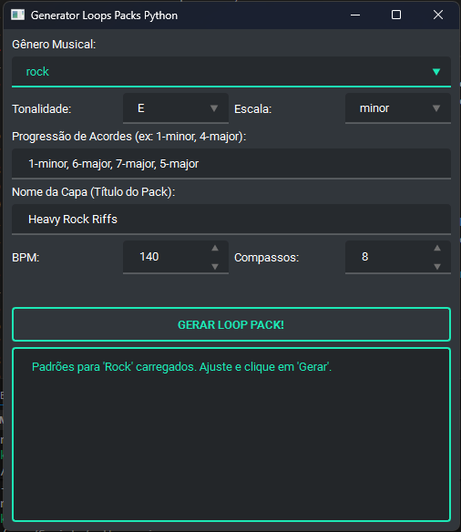

# Generator Loops Packs Python



Um programa desktop avançado para a geração algorítmica de pacotes de loops musicais. Criado em Python, este aplicativo combina teoria musical, aleatoriedade controlada e arte generativa para produzir pacotes de loops completos, prontos para produção musical e estudo.

---

## ✨ Funcionalidades Principais

* **5 Gêneros Musicais:** Gere loops autênticos nos estilos **Rock, Funk, Jazz, Blues e Reggae**.
* **Geração Multi-instrumental:** Cria automaticamente partes de **Baixo**, **Bateria** e **Piano/Teclado** que funcionam em harmonia.
* **Controle Criativo Total:** Personalize seus loops com controles para:
    * Tonalidade (Key)
    * Escala (Major/Minor)
    * Andamento (BPM)
    * Número de Compassos
    * **Progressão de Acordes customizável!**
* **Múltiplos Formatos de Saída:** Cada pack gerado inclui:
    * **MIDIs Individuais:** Arquivos `.mid` separados para baixo, bateria e piano.
    * **MIDI de Mix Completo:** Um arquivo `.mid` com todos os instrumentos juntos.
    * **Partitura Profissional:** Um arquivo `.pdf` com a partitura completa para todos os instrumentos.
* **Arte de Capa Generativa:** Cria uma capa de álbum `.png` única e estilizada para cada pack, usando algoritmos de arte generativa com paletas de cores adaptadas ao gênero musical.
* **Organização Automática:** Salva cada pack gerado em uma pasta nomeada de forma única para fácil organização.
* **Interface Gráfica Moderna:** Construído com PyQt6 e estilizado com `qt-material` para uma experiência de usuário limpa e agradável.

---

## 🛠️ Tecnologias Utilizadas

* **Linguagem:** Python 3
* **Interface Gráfica:** PyQt6
* **Estilização:** qt-material
* **Manipulação de MIDI:** Mido
* **Geração de Imagens:** Pillow e NumPy
* **Geração de Partituras:** LilyPond (via subprocesso)

---

## ⚙️ Pré-requisitos

Antes de instalar, você **PRECISA** ter duas coisas instaladas no seu sistema:

1.  **Python 3.10+**
2.  **LilyPond:**
    * Baixe e instale do site oficial: [lilypond.org](https://lilypond.org/)
    * **IMPORTANTE:** Durante a instalação, ou manualmente depois, você **DEVE** adicionar o LilyPond ao `PATH` do seu sistema. O programa não funcionará sem isso.

---

## 🚀 Instalação e Execução

1.  **Clone o repositório:**
    ```bash
    git clone [https://github.com/PhaellZX/generator-loops-packs-python](https://github.com/PhaellZX/generator-loops-packs-python.git)
    cd SEU-REPOSITORIO
    ```

2.  **Crie e ative um ambiente virtual:**
    ```bash
    # Use o caminho explícito para o seu Python para evitar conflitos
    /c/Users/Work/AppData/Local/Programs/Python/Python311/python.exe -m venv venv
    source venv/Scripts/activate
    ```

3.  **Instale as dependências:**
    ```bash
    pip install -r requirements.txt
    ```

4.  **Execute a aplicação:**
    ```bash
    # Use o caminho explícito para o Python do venv para garantir
    ./venv/Scripts/python main_app.py
    ```

---

## 🔮 Roadmap Futuro

* Migração para uma aplicação Web (SaaS) com sistema de assinaturas.
* Adição de mais gêneros e instrumentos.
* Implementação de mais algoritmos de arte generativa.

---

## 📄 Licença

Este projeto está licenciado sob a Licença MIT.